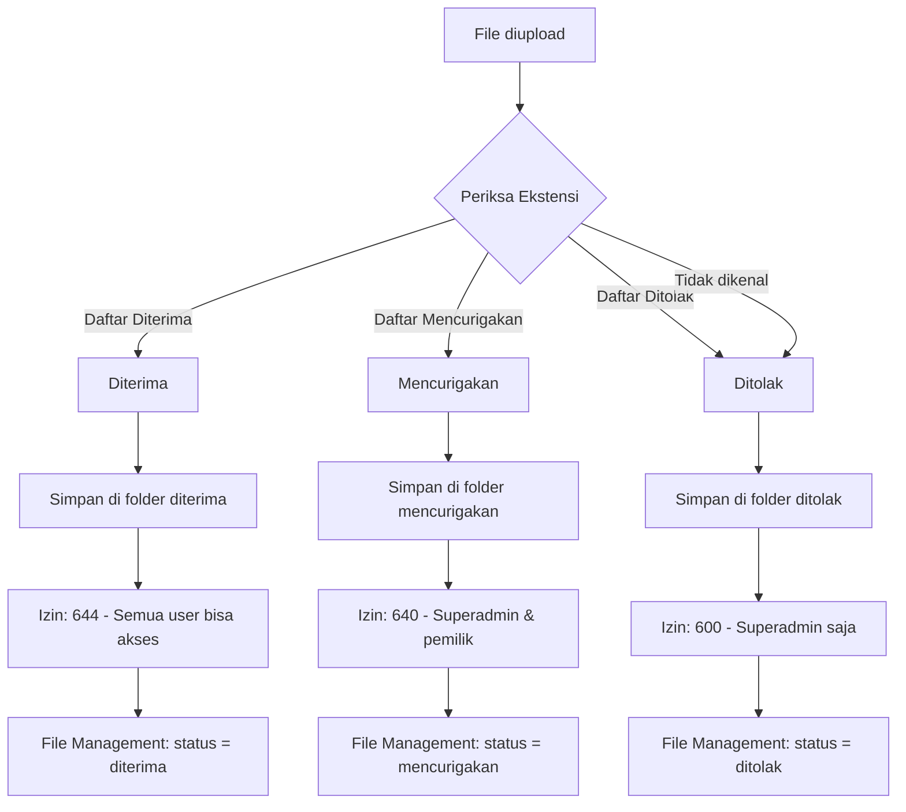

# Panduan Pemilahan File - Sistem File Management Superadmin

## Kategori File

### 1. Diterima (Accepted)
File-file yang aman dan diizinkan untuk diunggah ke sistem.

#### Dokumen
| Ekstensi | Keterangan |
|----------|------------|
| `.pdf` | Portable Document Format |
| `.doc` | Microsoft Word 97-2003 |
| `.docx` | Microsoft Word 2007+ |
| `.xls` | Microsoft Excel 97-2003 |
| `.xlsx` | Microsoft Excel 2007+ |
| `.ppt` | Microsoft PowerPoint 97-2003 |
| `.pptx` | Microsoft PowerPoint 2007+ |
| `.txt` | Plain text |
| `.csv` | Comma-Separated Values |
| `.rtf` | Rich Text Format |
| `.odt` | OpenDocument Text |
| `.ods` | OpenDocument Spreadsheet |
| `.odp` | OpenDocument Presentation |
| `.md` | Markdown |

#### Gambar
| Ekstensi | Keterangan |
|----------|------------|
| `.jpg` | JPEG Image |
| `.jpeg` | JPEG Image |
| `.png` | Portable Network Graphics |
| `.gif` | Graphics Interchange Format |
| `.bmp` | Bitmap Image |
| `.svg` | Scalable Vector Graphics |
| `.webp` | WebP Image |
| `.ico` | Icon File |

#### Lainnya
| Ekstensi | Keterangan |
|----------|------------|
| `.xps` | XML Paper Specification |

**Izin Folder:** 644 (rw-r--r--) — dapat dibaca oleh semua pengguna yang terautentikasi.

---

### 2. Mencurigakan (Suspicious)
File-file yang berpotensi berbahaya tetapi masih bisa ditinjau oleh superadmin.

| Ekstensi | Keterangan | Risiko |
|----------|------------|--------|
| `.exe` | Executable Program | Menjalankan kode sembarangan |
| `.msi` | Windows Installer | Menginstal perangkat lunak |
| `.bat` | Batch Script | Menjalankan perintah shell |
| `.cmd` | Command Script | Menjalankan perintah shell |
| `.vbs` | VBScript Script | Menjalankan kode VB |
| `.ps1` | PowerShell Script | Menjalankan perintah PowerShell |
| `.psm1` | PowerShell Module | Modul PowerShell |
| `.scr` | Screen Saver | Dapat berisi kode executable |
| `.jar` | Java Archive | Dapat berisi kode Java |
| `.zip` | ZIP Archive | Dapat berisi malware terkompresi |
| `.rar` | RAR Archive | Dapat berisi malware terkompresi |
| `.7z` | 7-Zip Archive | Dapat berisi malware terkompresi |
| `.tar` | TAR Archive | Dapat berisi malware terkompresi |
| `.gz` | GZip Archive | Dapat berisi malware terkompresi |
| `.lnk` | Windows Shortcut | Dapat menunjuk ke executable berbahaya |
| `.wsf` | Windows Script File | Menjalankan script campuran |

**Izin Folder:** 640 (rw-r-----) — hanya superadmin dan pemilik yang dapat membaca.

---

### 3. Ditolak (Rejected)
File-file yang sangat berbahaya dan **tidak diizinkan** di sistem. File tetap disimpan untuk audit tetapi akses sangat dibatasi.

| Ekstensi | Keterangan | Risiko |
|----------|------------|--------|
| `.php` | PHP Script | Eksekusi kode server-side |
| `.phtml` | PHP HTML | Eksekusi kode server-side |
| `.php3` | PHP 3 Script | Eksekusi kode server-side |
| `.php4` | PHP 4 Script | Eksekusi kode server-side |
| `.php5` | PHP 5 Script | Eksekusi kode server-side |
| `.php7` | PHP 7+ Script | Eksekusi kode server-side |
| `.php8` | PHP 8+ Script | Eksekusi kode server-side |
| `.html` | HTML File | Dapat berisi skrip berbahaya |
| `.htm` | HTML File | Dapat berisi skrip berbahaya |
| `.xhtml` | XHTML File | Dapat berisi skrip berbahaya |
| `.js` | JavaScript | Dapat berisi kode berbahaya |
| `.jsx` | JSX File | Dapat berisi kode berbahaya |
| `.mjs` | ES Module JS | Dapat berisi kode berbahaya |
| `.sql` | SQL Script | Manipulasi database |
| `.asp` | Active Server Pages | Eksekusi kode server-side |
| `.aspx` | ASP.NET Page | Eksekusi kode server-side |
| `.py` | Python Script | Eksekusi kode |
| `.pyc` | Python Compiled | Eksekusi kode |
| `.pl` | Perl Script | Eksekusi kode |
| `.cgi` | CGI Script | Eksekusi kode server-side |
| `.htaccess` | Apache Config | Manipulasi konfigurasi server |
| `.htpasswd` | Apache Password | Mengandung kredensial |
| `.com` | COM Executable | Eksekusi kode |
| `.sys` | System File | Dapat merusak sistem |
| `.dll` | Dynamic Link Library | Dapat berisi kode berbahaya |
| `.drv` | Driver File | Dapat merusak sistem |
| `.cpl` | Control Panel Item | Dapat menjalankan kode |

**Izin Folder:** 600 (rw--------) — hanya superadmin yang dapat membaca.

---

## Alur Pemilahan

## Catatan Keamanan
1. Ekstensi file diperiksa **sebelum** penyimpanan.
2. File ditolak tetap disimpan untuk kepentingan audit/forensik.
3. Setiap folder memiliki izin akses berbeda sesuai tingkat risikonya.
4. Semua aktivitas unggahan dicatat di Log Superadmin.
5. Superadmin dapat mengubah kategori file jika diperlukan.
