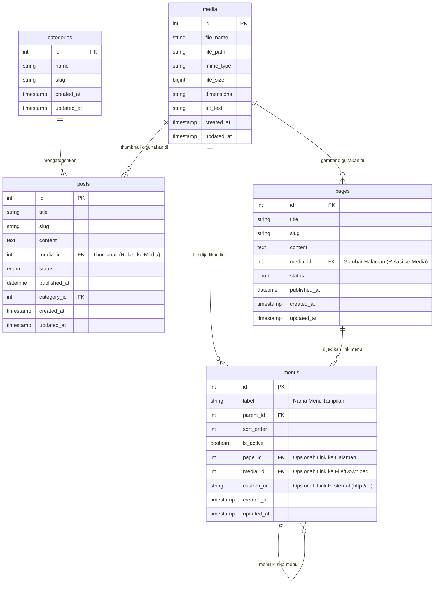

# Database Umum untuk RKM

```mermaid
erDiagram
    %% ====================
    %% === ENTITAS UTAMA ===
    %% ====================

    users {
        bigint id PK
        string nama
        string email
        string password
        string role "bendahara,sekretaris,logistik,ketua,anggota,superadmin"
        enum status "aktif,non_aktif"
        datetime created_at
        datetime updated_at
    }

    calon_anggota {
        bigint id PK
        string nama
        string email
        string telepon
        string alamat
        enum status "menunggu_verifikasi,disetujui,ditolak"
        bigint anggota_id FK
        datetime created_at
        datetime updated_at
    }

    keluarga_anggota {
        bigint id PK
        bigint calon_anggota_id FK
        string nama
        string hubungan "suami,istri,anak,orang_tua,lainnya"
        string jenis_kelamin "laki-laki,perempuan"
        date tanggal_lahir
        datetime created_at
        datetime updated_at
    }

    anggota {
        bigint id PK
        string nomor_anggota
        bigint calon_anggota_id FK
        string nama
        string email
        string telepon
        string alamat
        enum status "aktif,non_aktif"
        bigint created_by FK
        datetime created_at
        datetime updated_at
    }

    %% ========================
    %% === KEUANGAN (BENDAHARA) ===
    %% ========================

    kategori_pemasukan {
        bigint id PK
        string nama
        string deskripsi
        datetime created_at
    }

    kategori_pengeluaran {
        bigint id PK
        string nama
        string deskripsi
        datetime created_at
    }

    pemasukan {
        bigint id PK
        date tanggal
        bigint kategori_pemasukan_id FK
        decimal jumlah
        string keterangan
        string file_bukti
        bigint created_by FK
        datetime created_at
        datetime updated_at
    }

    pengeluaran {
        bigint id PK
        date tanggal
        bigint kategori_pengeluaran_id FK
        decimal jumlah
        string keterangan
        string file_bukti
        bigint created_by FK
        datetime created_at
        datetime updated_at
    }

    iuran_tahunan {
        bigint id PK
        int tahun
        bigint anggota_id FK
        int bulan
        decimal nominal
        enum status "lunas,belum_lunas"
        date tanggal_bayar
        string file_bukti
        bigint verified_by FK
        bigint pemasukan_id FK
        datetime created_at
        datetime updated_at
    }

    pembayaran {
        bigint id PK
        date tanggal_daftar
        bigint calon_anggota_id FK
        decimal nominal_pembayaran
        enum status "belum_lunas,sudah_dibayar"
        string file_bukti
        bigint verified_by FK
        bigint pemasukan_id FK
        string catatan
        datetime created_at
        datetime updated_at
    }

    %% ================================
    %% === LOG AKTIVITAS (UNTUK KETUA) ===
    %% ================================

    log_aktivitas {
        bigint id PK
        bigint user_id FK
        string aksi
        string deskripsi
        string modul
        bigint referensi_id
        datetime created_at
    }

    %% ============================
    %% === LOGISTIK ===
    %% ============================

    kategori_barang {
        bigint id PK
        string nama "atk,elektronik,kebersihan,dsn"
        string deskripsi
        datetime created_at
    }

    kategori_aset {
        bigint id PK
        string nama "kendaraan,elektronik,furnitur,dll"
        string deskripsi
        datetime created_at
    }

    stok_barang {
        bigint id PK
        string kode_barang "auto: TPH-I, ELK-2, dls"
        string nama_barang
        int stok "stok saat ini"
        int stok_minimum "batas peringatan"
        string satuan "pcs,rim,lusin,box"
        bigint kategori_barang_id FK
        enum status "tersedia,habis"
        datetime created_at
        datetime updated_at
    }

    aset_kendaraan {
        bigint id PK
        string kode_aset "auto: KDR-1, ELT-2, dls"
        string nama_aset
        string nomor_plat_seri "B 1234 XY / SN-XXX"
        bigint kategori_aset_id FK
        enum status "tersedia,dipinjam,rusak,dihapus"
        datetime created_at
        datetime updated_at
    }

    riwayat_barang {
        bigint id PK
        datetime waktu
        enum tipe "masuk,keluar,dipinjam,dikembalikan"
        enum tipe_referensi "stok_barang,aset_kendaraan"
        bigint referensi_id "id stok_barang ATAU aset_kendaraan"
        int jumlah "null jika aset"
        string keterangan "nama supplier/nama peminjam"
        bigint user_id FK "logistik yang melakukan"
        datetime created_at
    }

    %% ============================
    %% === KETUA ===
    %% ============================

    permintaan_izin {
        bigint id PK
        bigint user_id FK "user yang meminta izin"
        bigint approved_by FK "ketua yang menyetujui/menolak"
        string target_table "pemasukan,pengeluaran,stok_barang,aset_kendaraan,dll"
        bigint target_id "ID record yang ingin diedit"
        string field_name "nama field yang ingin diubah"
        text old_value "nilai sebelumnya"
        text new_value "nilai yang diinginkan"
        text alasan "alasan permintaan izin"
        enum status "menunggu,disetujui,ditolak"
        datetime approved_at
        datetime created_at
        datetime updated_at
    }

    %% ============================
    %% === SUPERADMIN (NEW) ===
    %% ============================

    file_organisasi {
        bigint id PK
        string nama_file
        string file_path
        enum status "aktif,diperiksa,arsip,dihapus"
        bigint uploaded_by FK
        datetime created_at
        datetime updated_at
    }

    log_superadmin {
        bigint id PK
        bigint user_id FK "user yang melakukan aksi"
        string aksi "Upload File, Tampilkan File, Memberi Izin Edit, dll"
        string deskripsi
        string modul
        bigint referensi_id
        string ip_address "untuk deteksi suspicious activity"
        string user_agent "info browser/device untuk audit"
        datetime created_at
    }

    %% ============================
    %% === RELASI ===
    %% ============================

    %% === RELASI USERS ===
    users ||--o{ pemasukan : "mencatat"
    users ||--o{ pengeluaran : "mencatat"
    users ||--o{ anggota : "mendaftarkan"
    users ||--o{ iuran_tahunan : "memverifikasi"
    users ||--o{ pembayaran : "memverifikasi"
    users ||--o{ log_aktivitas : "melakukan"
    users ||--o{ riwayat_barang : "mengelola"

    %% === RELASI CALON & ANGGOTA ===
    calon_anggota ||--o| anggota : "dikonfirmasi_menjadi"
    calon_anggota ||--o{ keluarga_anggota : "mencantumkan"
    calon_anggota ||--o{ pembayaran : "membayar"
    anggota ||--o{ iuran_tahunan : "membayar"

    %% === RELASI KATEGORI KEUANGAN ===
    kategori_pemasukan ||--o{ pemasukan : "memiliki"
    kategori_pengeluaran ||--o{ pengeluaran : "memiliki"

    %% === RELASI PEMASUKAN ===
    pemasukan ||--o{ iuran_tahunan : "tercatat_sebagai"
    pemasukan ||--o{ pembayaran : "tercatat_sebagai"

    %% === RELASI KATEGORI LOGISTIK ===
    kategori_barang ||--o{ stok_barang : "mengelompokkan"
    kategori_aset ||--o{ aset_kendaraan : "mengelompokkan"

    %% === RELASI LOGISTIK ===
    stok_barang ||--o{ riwayat_barang : "dicatat_riwayatnya"
    aset_kendaraan ||--o{ riwayat_barang : "dicatat_riwayatnya"

    %% === RELASI KETUA ===
    users ||--o{ permintaan_izin : "meminta"
    users ||--o{ permintaan_izin : "menyetujui/menolak"

    %% === RELASI SUPERADMIN (NEW) ===
    users ||--o{ file_organisasi : "mengupload"
    users ||--o{ log_superadmin : "dicatat"
```

# Database CMS RKM

```mermaid
erDiagram
    %% Tabel Categories
    categories {
        int id PK
        string name
        string slug
        timestamp created_at
        timestamp updated_at
    }

    %% Tabel Posts
    posts {
        int id PK
        string title
        string slug
        text content
        int media_id FK "Thumbnail (Relasi ke Media)"
        enum status
        datetime published_at
        int category_id FK
        timestamp created_at
        timestamp updated_at
    }

    %% Tabel Pages
    pages {
        int id PK
        string title
        string slug
        text content
        int media_id FK "Gambar Halaman (Relasi ke Media)"
        enum status
        datetime published_at
        timestamp created_at
        timestamp updated_at
    }

    %% Tabel Menus (Diperbarui)
    menus {
        int id PK
        string label "Nama Menu Tampilan"
        int parent_id FK
        int sort_order
        boolean is_active
        
        %% Kolom Opsi Link (Hanya satu yang terisi)
        int page_id FK "Opsional: Link ke Halaman"
        int media_id FK "Opsional: Link ke File/Download"
        string custom_url "Opsional: Link Eksternal (http://...)"

        timestamp created_at
        timestamp updated_at
    }

    %% Tabel Media
    media {
        int id PK
        string file_name
        string file_path
        string mime_type
        bigint file_size
        string dimensions
        string alt_text
        timestamp created_at
        timestamp updated_at
    }

    %% Relasi
    categories ||--|{ posts : "mengategorikan"
    menus ||--o{ menus : "memiliki sub-menu"

    %% Relasi ke Media Terpusat
    media ||--o{ posts : "thumbnail digunakan di"
    media ||--o{ pages : "gambar digunakan di"
    media ||--o{ menus : "file dijadikan link"

    %% Relasi Menu ke Halaman
    pages ||--o{ menus : "dijadikan link menu"
```